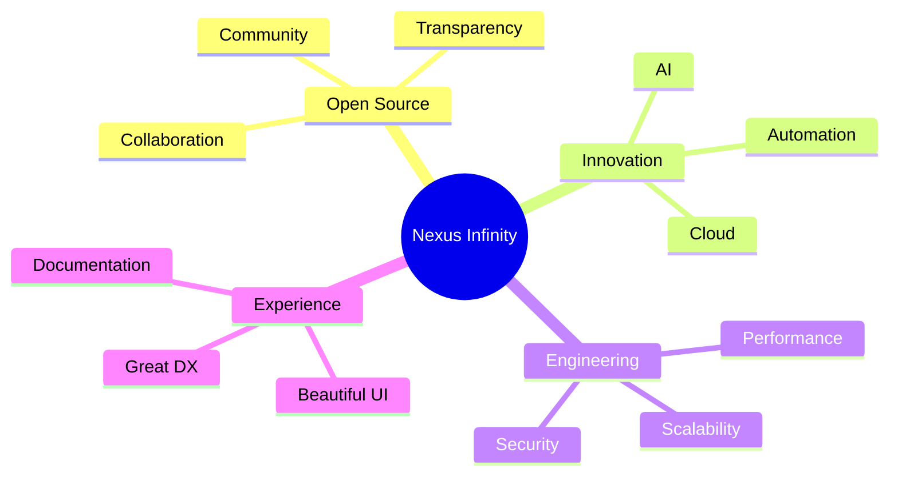

<div align="center">


<p align="center">

</p>

<p align="center">


</p>

</div>

---

# 🌌 About

> **Nexus Infinity** is a collective of developers, designers, and innovators creating modern open-source software that pushes ideas beyond limits.

We don't just build applications—we craft tools, frameworks, and platforms that developers genuinely enjoy using.

From AI-powered experiences to developer infrastructure, every project is designed with performance, simplicity, and long-term maintainability in mind.

---

# ✨ Vision

<table>
<tr>
<td width="33%" align="center">

### 🚀 Build
Create software that feels effortless.

</td>
<td width="33%" align="center">

### 🌍 Share
Open source is stronger together.

</td>
<td width="33%" align="center">

### ♾️ Innovate
Never stop exploring what's possible.

</td>
</tr>
</table>

---

# ⚡ What We Create

<div align="center">

| 🧠 Intelligence | 🌐 Web | ⚙️ Infrastructure |
|:---:|:---:|:---:|
| AI Applications | Modern Websites | APIs |
| LLM Tools | Frontend Frameworks | Cloud Services |
| Automation | Dashboards | Backend Systems |

| 📦 Developer Tools | 🔐 Security | ☁️ Cloud |
|:---:|:---:|:---:|
| CLI Utilities | Authentication | DevOps |
| Libraries | Encryption | Automation |
| SDKs | Secure APIs | Deployment |

</div>

---

# 💎 Core Principles

```text
⚡ Performance First
──────────────────────────────────────────────

Every millisecond matters.
Every optimization counts.
```

```text
🔒 Security by Default
──────────────────────────────────────────────

Privacy isn't optional.
Security isn't an afterthought.
```

```text
❤️ Open Source Forever
──────────────────────────────────────────────

Knowledge grows when shared.
Communities build better software.
```

---

# 🛠 Technology

<p align="center">


</p>

---

# 🌠 Why Nexus Infinity?



---

# 📖 Philosophy

```text
Great software isn't measured by how much code it contains.

It's measured by how many problems it solves.

We believe simplicity scales.
We believe quality compounds.
We believe open source changes everything.
```

---

# 🌍 Join the Journey

Whether you're:

- 💻 A Developer
- 🎨 A Designer
- ✍️ A Technical Writer
- 🧪 A Tester
- 🚀 An Innovator

There's a place for you at **Nexus Infinity**.

---

# 🤝 Contributing

Every contribution matters.

```text
🐛 Report Bugs
✨ Suggest Features
📚 Improve Documentation
⚡ Optimize Performance
🔒 Enhance Security
💙 Submit Pull Requests
```

Together, we can build software that lasts.

---

<div align="center">

## ♾️ Beyond Code

> *"The future isn't something we wait for—it's something we build."*

<br>

⭐ **Star our repositories if our work inspires you.**

### Welcome to **Nexus Infinity**.


</div>
